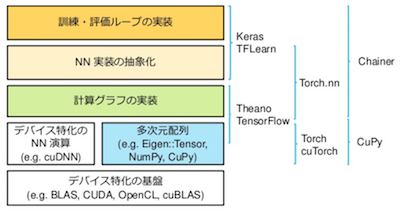

# 課題

## 勉強計画

| 日付 | 5/11 | 5/18 |  5/25 | 6/01 | 6/08 | 6/15 | 6/22 | 6/29 | 7/06 | 7/13 | 7/20 |
|:----:|:----:|:----:|:-----:|:----:|:----:|:----:|:----:|:----:|:----:|:----:|:----:|
| 実施 | 予定 | 予定 |  休み | 予定 | 予定 | 予定 | 予定 | 予定 | 予定 | 予定 | 予定 |
| 内容 |   1  |   1  |  休み |   2  |   3  |   4  |   5  |   5  |   6  |   6  | 予備 |

## 深層学習基礎理論
### 1. Numpyの基礎
**内容：Pythonと線形代数，行列・テンソル**
- [introduction to numpy](https://github.com/rasbt/deep-learning-book/blob/master/code/appendix_f_numpy-intro/appendix_f_numpy-intro.ipynb?utm_campaign=Data%2BElixir&utm_medium=email&utm_source=Data_Elixir_128)  
「Introduction to Artificial Neural Networks and Deep Learning: A Practical Guide with Applications in Python 」を一通り．ノートブック形式は，[ここ](https://github.com/rasbt/deep-learning-book)

### 2. 機械学習の基礎
**内容：Logistic Regression, Softmax, train/dev/testデータセット,学習プロセス**
#### 2.1 Logistic Regression
- [Kerasによる2クラスロジスティック回帰](http://aidiary.hatenablog.com/entry/20161030/1477830597)
- [Kerasによる2クラス分類（Pima Indians Diabetes）](http://aidiary.hatenablog.com/entry/20161103/1478176348)
- [Kerasによる多クラス分類（Iris）](http://aidiary.hatenablog.com/entry/20161108/1478609028)

#### 2.2 Softmax
#### 2.3 データセット，学習プロセス(scikit-learn)

### 3. Perceptron + Feed Forward Network, Gradient Descent
**内容：Gradient Descent, MLP**
#### 3.1 Gradient Descent(勾配降下法)
#### 3.2 MultiLayer Perceptron(MLP)
- [KerasでMNIST](http://aidiary.hatenablog.com/entry/20161109/1478696865)

### 4. Stochastic Gradient Descent, Optimizers
**内容：各種Optimizers, 重みの初期化など**
#### 4.1 オプティマイザー(最適化手法)
#### 4.2 重みの初期化

### 5. Convolutional Neural Networks(CNN) 1
**内容：CNN基礎, 畳込み, プーリング**
#### 5.1 CNN基礎
#### 5.2 畳込み層
#### 5.3 プーリング層

### 6. Convolutional Neural Networks(CNN) 2
**内容：Understanding and Visualizing Convolutional Neural Networks**

### 7. Convolutional Neural Networks(CNN) 3
**内容：Transfer Learning and Fine-tuning Convolutional Neural Networks**

## フレームワーク実践演習
### Chainer
- [Chainerハンズオン](http://qiita.com/mitmul/items/eccf4e0a84cb784ba84a)  
現在，一番良い資料．ノートブック形式は，[ここ](https://github.com/mitmul/chainer-handson)

### Keras

### ChainerとKerasとの違い
- [kerasとchainerの違い](http://s0sem0y.hatenablog.com/entry/2017/01/10/233242)  
**Keras**: TensorFlowをバックエンドに，直感的な記述でニューラルネットを記述可能にしたライブラリ．テンソル計算と計算グラフをTensorFlowで実現して，Kerasはそれをニューラルネット用にまとめたもの．  
**Chainer**: 計算グラフの実装からニューラルネットの学習までの記述をカバー．テンソル計算をCupyやNumpyで補うスタイル．

## 参考文献
- [2017年度Deep Learning基礎講座](http://ail.tokyo/ja/aai-2017/)
- [CS231n: Convolutional Neural Networks for Visual Recognition](http://cs231n.stanford.edu/syllabus.html)
