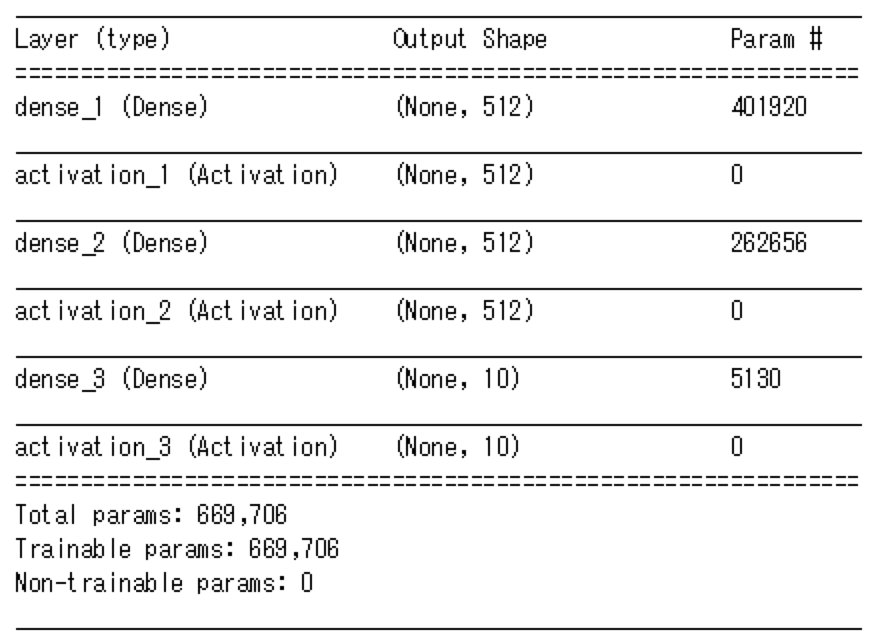

# Kerasプログラミング基礎

## 1. MNISTの手書き数字認識(多層パーセプトロン編)
まずは，基本的なデータセットであるMNISTを使って，Kerasを使った学習の流れを理解していきます．基本的に以下のフローで学習を行います．
1. データのロード
2. モデルの定義
3. モデルのコンパイル
  3. .compile()で損失関数，最適化手法，評価指標を指定
4. モデルの学習
  4. .fit()で学習．学習回数，バッチサイズ
5. モデルの評価
  6. .evaluate()で評価．

なので，上記の流れに沿って，学習の流れを確認しましょう．

### 1. データのロード
まずは学習に使うデータをロードしてみます．Kerasでは有名なデータセットはKeras側で既に用意されています．`from keras.datasets import mnist`などとしてデータセットを使うことができます．以下では，`mnist.load_data()`でロードして，trainとtest(label)にわけています．
```
from keras.datasets import mnist

# MNISTデータのロード
(x_train, y_train), (x_test, y_test) = mnist.load_data()
```
ロードしたデータをmatplotlibを使って画像を表示してみます．(Jupyter環境を仮定)
```
%matplotlib inline
import matplotlib.pyplot as plt

#MNISTデータの表示
fig = plt.figure(figsize=(9, 9))
fig.subplots_adjust(left=0, right=1, bottom=0, top=0.5, hspace=0.05, wspace=0.05)
for i in range(81):
    ax = fig.add_subplot(9, 9, i + 1, xticks=[], yticks=[])
    ax.imshow(x_train[i].reshape((28, 28)), cmap='gray')
```
コードを実行すると0から9までの手書き数字画像が表示されます．


MNISTのデータロードが終わったら，次は，前処理として入力の形状をKerasに合うように**reshape**したり，**正規化**したり，**クラスラベルをone-hotエンコーディング形式に変形**します．
```
from keras.utils import np_utils
nb_classes = 10

# 画像を1次元配列化
x_train = x_train.reshape(60000, 784)
x_test = x_test.reshape(10000, 784)

# 画素を0.0-1.0の範囲に変換
x_train = x_train.astype('float32')
x_test = x_test.astype('float32')
x_train /= 255
x_test /= 255

print(x_train.shape[0], 'train samples')
print(x_test.shape[0], 'test samples')

# one-hot-encoding
Y_train = np_utils.to_categorical(y_train, nb_classes)
Y_test = np_utils.to_categorical(y_test, nb_classes)
```
- KerasでロードしたMNISTは`(60000, 28, 28)`なので，(60000, 784)に`reshape`
- 画像の0~255の画素値を0.0~1.0に正規化
- one-hot-encoding形式は以下のようなものです．
```
0→[1,0,0,0,0,0,0,0,0,0]
1→[0,1,0,0,0,0,0,0,0,0]
2→[0,0,1,0,0,0,0,0,0,0]
3→[0,0,0,1,0,0,0,0,0,0]
・・・
```
### 2. モデルの定義
Kerasでは，空のSequentialモデルを作成し，そこに層(Dense)や活性化関数(Activation)を順番に`add`することでモデルを定義します．Sequentialモデルは通常のニューラルネットのように層を積み重ねたモデルを指します．今回は隠れ層が2つのある多層パーセプトロンを構築し，活性化関数には`relu`を用いています．

```
from keras.models import Sequential
from keras.layers.core import Dense, Activation

model = Sequential()

#最初の層では入力の形(今回は,784)を指定する．以降の層では不要
model.add(Dense(512, input_shape=(784,)))
model.add(Activation('relu'))
model.add(Dense(512))
model.add(Activation('relu'))
model.add(Dense(10))
model.add(Activation('softmax'))
```
- Desen: 全結合層(今回は，ノード数を512に指定)
- Activation: 活性化関数

また，`summary()`を使うとモデル形状のサマリを表示させることができます．
```
model.summary()
```


### 3. モデルのコンパイル
前ステップでSequentialで空モデルを作成後，`.add()`メソッドで層を追加してモデルを作ったら，`.compile()`でモデルをコンパイルします．コンパイルでは，最適化手法(optimizer)，損失関数(loss)，評価指標(metrics)を指定します．

```
from keras.optimizers import Adam

model.compile(loss='categorical_crossentropy',
              optimizer=Adam(),
              metrics=['accuracy'])
```
- loss: 損失関数(多値分類: categorical_crossentropy, 二値分類: binary_crossentropy)
- optimizer: 最適化手法
- metrics: 評価指標

### 4. モデルの学習
コンパイルが終わったら，`.fit()`によりモデルを学習します．
```
batch_size = 128
epochs = 20
history = model.fit(x_train, Y_train,
                            batch_size=batch_size,
                            epochs=epochs,
                            validation_split=0.1
                            verbose=1)
```

- batch_size: 学習データから設定したサイズ毎データを取り出し，計算を行う
- epechs: モデルを学習するエポック数(学習データ全体を何回繰り返し学習させるか)を指定
- verbose: ログ出力(0: 標準出力にログを出力しない，1: ログをプログレスバーで標準出力，2: エポック毎に1行のログを出力)

学習後，ロスと精度が出力されます．`loss: 1.3483 - acc: 0.4979 - val_loss: 1.3027 - val_acc: 0.5118`
### 5. モデルの評価
`model.fit`で学習させた経過を`history`で受けていたので，`matplotlib`を使って学習経過を表示してみます．
```
#正答率
plt.plot(history.history['acc'])
plt.plot(history.history['val_acc'])
plt.title('model accuracy')
plt.ylabel('accuracy')
plt.xlabel('epoch')
plt.legend(['train', 'val'], loc='upper left')
plt.show()
#loss
plt.plot(history.history['loss'])
plt.plot(history.history['val_loss'])
plt.title('model loss')
plt.ylabel('loss')
plt.xlabel('epoch')
plt.legend(['train', 'val'], loc='upper left')
plt.show()
```


```
_, acc = model.evaluate(x_test, Y_test, verbose=0)
print('accuracy: {}'.format(acc))
# accuracy: 0.4952
```
今回は，精度49.5%のモデルが出来上がりました．ついでに，混合行列でテストデータに対して予測した結果のラベルごとの分布を表示させてみましょう．

```
from sklearn.metrics import classification_report, confusion_matrix

labels_pred = model.predict_classes(x_test, verbose=0)

print(confusion_matrix(y_test, labels_pred))
print(classification_report(y_test, labels_pred))
```

- Precision: 適合率
- Recall: 再現率
- F-Score: F値

## 提出方法
自身のgithubリポジトリ(uecyanailab/uectest-アカウント名)中に**keras**フォルダを作成して，uecyanailab/uectest-アカウント名/keras/repo1などのように各レポート毎にフォルダを分けて，そこにJupiter ノートブック形式で各レポート課題の実行結果と考察をまとめて下さい．．  
**注意**
- プログラムコード以外はMarkdownで書いて下さい．
- 各レポート課題で指定されている内容は必ず盛り込むようにして下さい．

## レポート課題１(Keras基礎プログラミング)
上記の例を実際に試して見ましょう．その際，モデルを変えたり，最適化手法を変えたり，初期値の重みを変えたりして遊んでみましょう．

## レポート課題２(sin関数の学習)
[画像認識システム特論の練習問題１−４](http://mm.cs.uec.ac.jp/sys/text/1.html) をKerasで書き換えましょう．Chainer版[sin関数の学習](http://mm.cs.uec.ac.jp/sys/text/sample_sin.html)を参考にして下さい．


## レポート課題３(モデル探索)
まず，データセットをcifar-10に変更して，3層NLPモデル(Fully-connected Neural Network)を定義します．そして，以下を行って下さい．
1. DropOut層を追加して学習させましょう．DropOutの仕組みを簡単にまとめて，考察して下さい．
1. DropOut層の代わりにBatch normalization層(BN層)を追加して学習させましょう．BN層の仕組みを簡単にまとめて，考察して下さい．
1. 3層NLPモデル(Fully-connected Neural Network)をConvolutional Neural Network(CNN)に変更して，学習させましょう．

## レポート課題４(学習方法の比較)
Kaggleの[Dogs vs. Cats](https://www.kaggle.com/c/dogs-vs-cats)で提供されているデータセットを用います．(Kaggleに登録すればデータセットをダウンロードできるようになるので登録しましょう．)訓練データのtrain.zipを解凍すると犬の画像が12500枚，猫の画像が12500枚含まれているので，その中から，犬1000枚，猫1000枚を学習画像として利用します．また，犬400枚，猫400枚を評価画像として利用するので，train.zip中の画像を振り分けて下さい．  
そして，以下の3つの学習方法を実際に試してみて，認識精度を比較して下さい．
1. shallow CNN(convが3層)をスクラッチから学習
1. VGG16が抽出した特徴を使って多層パーセプトロンを学習
1. VGG16をFine-tune

## レポート課題５(独自モデルの定義)
ネットワークを色々工夫してcifar-10で精度70%以上を達成して下さい．その際，以下の点をレポートに記載して下さい．
- データ利用方法(データをどのように加工して使ったか)
- モデリングの工夫点(予測モデルを構築する上で，どのような工夫をしたか)
- 結果の考察
- 参考にしたサイト

### 参考文献
- [What is the class of this image ?](http://rodrigob.github.io/are_we_there_yet/build/classification_datasets_results.html#43494641522d3130)

## 補足課題(表現学習)
CNNの各層を可視化することで，各レイヤでどのような特徴表現を学習しているかを考察して下さい．

## 2. MNISTの手書き数字認識(CNN編)

## 3. Kerasによる転移学習(Fine-tune)
### 3.1: Fine-tuneとは
### 3.2: 実際にFine-tuneしてみよう

### 参考文献
- [Keras公式MNISTチュートリアル](https://github.com/fchollet/keras/blob/master/examples/mnist_mlp.py)
